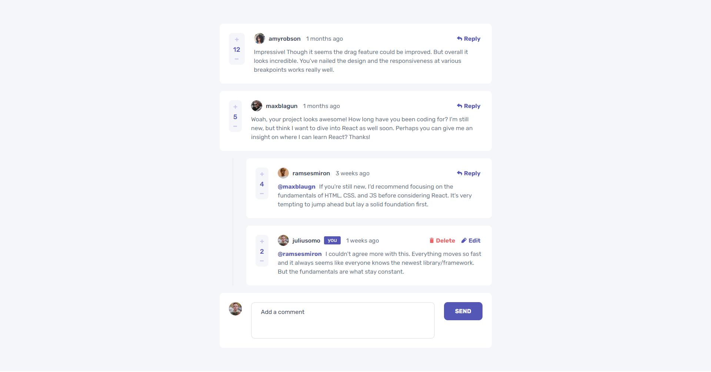

# Interactive comments section

This is a solution to the [Interactive comments section challenge on Frontend Mentor](https://www.frontendmentor.io/challenges/interactive-comments-section-iG1RugEG9). Frontend Mentor challenges help you improve your coding skills by building realistic projects.

 

 

## The challenge

- Optimal layout for the app depending on their device's screen size.
- Hover states for all interactive elements on the page.
- Create, Read, Update, and Delete comments and replies.
- Up-vote and down-vote comments.
- Tracks the time dynamically since the comment or reply was posted.

 

## Links

- [Solution URL](https://github.com/developingWeb/interactive-comments-section)
- [Live Site URL](https://interactive-comments-section-developingweb.vercel.app)

 

## Built with

- CSS custom properties
- Flex-box
- Mobile-first workflow
- [React](https://reactjs.org/) - JS library

 

## What I learned

 - I learned how to calculate the time between current time and given time.

 

## Continued development

- I still want to add the feature : 
  - which sort the comments the comment of the basis of their votes

 

## Author

- Frontend Mentor - [@developingWeb](https://www.frontendmentor.io/profile/developingWeb)
